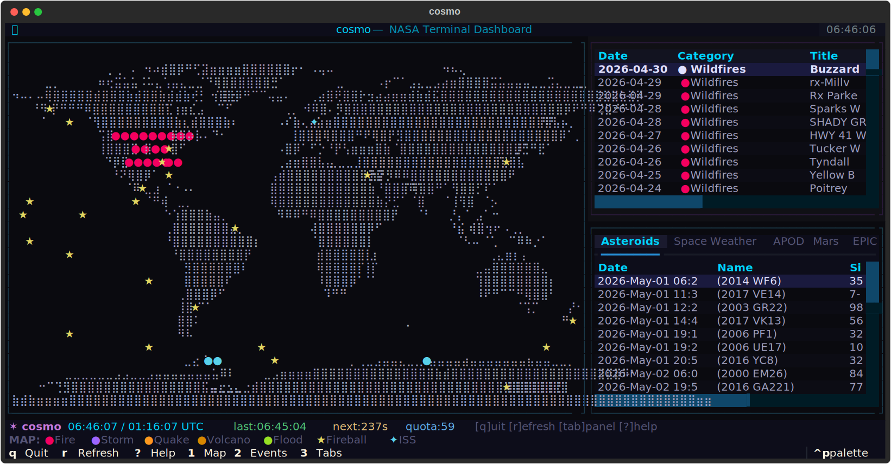

# cosmo-tui

A terminal dashboard for NASA's open data. Real-time world map, asteroid tracker, ISS tracker, space weather, Mars rover photos, Earth imagery, and more — all in your terminal.

Built with [Textual](https://github.com/Textualize/textual) and [Rich](https://github.com/Textualize/rich).

## Features

- **ASCII World Map** — High-performance Braille-character world map with a spatial-grid optimization for smooth rendering.
- **Natural Event Tracking** — Wildfires, storms, earthquakes, volcanoes, floods from NASA's EONET API, plotted as color-coded markers on the map.
- **ISS Tracker** — Real-time International Space Station position plotted on the map, updated using TLE + SGP4 orbital computation.
- **Mars Rover Photos** — Latest high-resolution photos from NASA's Perseverance and Curiosity rovers, including camera and Sol data.
- **EPIC Earth Imagery** — Daily natural color imagery of the entire Earth captured by the DSCOVR satellite's EPIC camera.
- **Space Weather** — Live monitor for solar flares, coronal mass ejections (CME), geomagnetic storms, and solar energetic particles (DONKI API).
- **Asteroid Tracker & Sentry Watch** — Upcoming NEO close approaches and impact risk monitors with Palermo/Torino scale ratings.
- **Fireball Events** — Meteorite atmospheric impacts detected by US government sensors, plotted on the map.
- **Astronomy Picture of the Day** — Daily APOD with full descriptions and HD image links.
- **Theming Support** — Choose between a modern "Default" theme or a retro "Classic" monochrome green terminal look.
- **High Performance** — Concurrent API fetching and optimized rendering engine for a smooth TUI experience.

### Map Legend

| Marker | Color | Meaning |
|--------|-------|---------|
| `●` | Red | Wildfires |
| `●` | Blue | Severe Storms |
| `●` | Yellow | Earthquakes |
| `●` | Orange | Volcanoes |
| `●` | Green | Floods |
| `★` | Bright Yellow | Fireball Impacts |
| `✦` | Bright Cyan | ISS Position |

## Installation

### From PyPI

```bash
pip install cosmo-tui
```

Or with [pipx](https://pipx.pypa.io/) (recommended for CLI tools):

```bash
pipx install cosmo-tui
```

### From Source

```bash
git clone https://github.com/irahulstomar/cosmo-tui.git
cd cosmo-tui
pip install -e .
```

## Getting Your NASA API Key

Cosmo uses NASA's free public APIs. You'll need an API key (takes 30 seconds):

1. Go to **[https://api.nasa.gov](https://api.nasa.gov)**
2. Fill in your **First Name**, **Last Name**, and **Email**
3. Click **Sign Up**
4. Your API key will be **emailed to you instantly** and also shown on the page
5. Copy the key.

That's it. The key is free, gives you **1,000 requests per hour**, and never expires.

> **Don't want to sign up?** You can use NASA's public `DEMO_KEY` which works but is rate-limited to 30 requests/hour and 50/day. Run cosmo with `--use-demo-key` to use it.

## Usage

```bash
cosmo                    # Launch the dashboard
cosmo --theme classic    # Use retro green terminal theme
cosmo --use-demo-key     # Use NASA's rate-limited DEMO_KEY
cosmo --reset-key        # Re-enter your API key
cosmo --refresh 120      # Set refresh interval to 120 seconds (default: 300)
cosmo --version          # Show version
cosmo --help             # Show help
```

On first run, cosmo will prompt you to enter your NASA API key. It validates the key with a test API call, then saves it locally so you never have to enter it again.

### Where is my API key stored?

Your key is saved locally on your machine in a config file:

| OS | Path |
|----|------|
| Windows | `%LOCALAPPDATA%\cosmo\cosmo\config.json` |
| Linux | `~/.config/cosmo/config.json` |
| macOS | `~/Library/Application Support/cosmo/config.json` |

The file is set to owner-only permissions (`600`). Your key is **never** sent anywhere except to `api.nasa.gov`.

## Keybindings

| Key | Action |
|-----|--------|
| `q` | Quit |
| `r` | Refresh all data |
| `1` | Focus world map |
| `2` | Focus event list |
| `3` | Focus tab panels |
| `?` | Show help overlay |
| `Tab` | Cycle panel focus |
| `↑↓` | Scroll within active panel |

## Data Sources

| Panel | API | Update Frequency |
|-------|-----|-----------------|
| World Map + Events | [EONET v3](https://eonet.gsfc.nasa.gov/docs/v3) | Every refresh cycle |
| Mars Photos | [Mars Rover Photos](https://api.nasa.gov/#mars-photos) | Every refresh cycle |
| EPIC Earth | [EPIC API](https://api.nasa.gov/#epic) | Every refresh cycle |
| Asteroids | [NeoWs](https://api.nasa.gov/#asteroids-neows) | Every refresh cycle |
| Space Weather | [DONKI](https://api.nasa.gov/#donki) | Every refresh cycle |
| APOD | [APOD API](https://api.nasa.gov/#apod) | Every refresh cycle |
| Fireballs | [JPL Fireball API](https://ssd-api.jpl.nasa.gov/doc/fireball.html) | Every refresh cycle |
| Sentry Watch | [JPL Sentry API](https://ssd-api.jpl.nasa.gov/doc/sentry.html) | Every refresh cycle |
| ISS Position | [TLE API](http://tle.ivanstanojevic.me/) + SGP4 | Every 30 seconds |

## Requirements

- **Python 3.10+**
- A terminal with **Unicode** and **truecolor** support

### Supported Terminals

| Terminal | Support |
|----------|---------|
| Windows Terminal | Full |
| WezTerm | Full |
| iTerm2 (macOS) | Full |
| Kitty | Full |
| Most Linux terminals | Full |
| macOS Terminal.app | Partial (limited colors) |
| Windows cmd.exe | Not supported |

## Tech Stack

- **[Textual](https://github.com/Textualize/textual)** — TUI framework
- **[Rich](https://github.com/Textualize/rich)** — Terminal text formatting
- **[httpx](https://github.com/encode/httpx)** — Async HTTP client
- **[sgp4](https://github.com/brandon-rhodes/python-sgp4)** — Satellite orbit propagation (ISS tracking)
- **[platformdirs](https://github.com/platformdirs/platformdirs)** — Cross-platform config paths

## License

MIT
